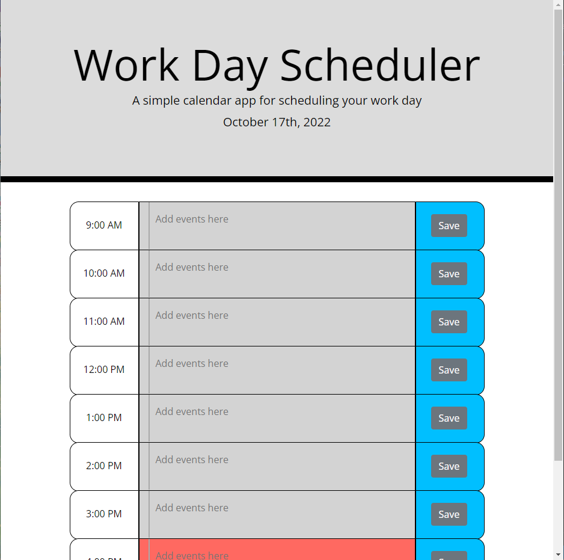

# Work-Day-Scheduler #

## Table of Contents ##

* [Description](#description)
    Description
* [Usage]
* Mock-Up
* Link to Scheduler 
* License

## Description ##

A repository for the Work Day Scheduler made during module 5 of the UTA Bootcamp. This application was made to track in real time events given by the user!

### Usage ###

Click the URL link below to visit the scheduler. Input events in different time blocks and save the events with the Save button.

### Mock-Up ###

### Link To Application ###

[Application-Link] 

